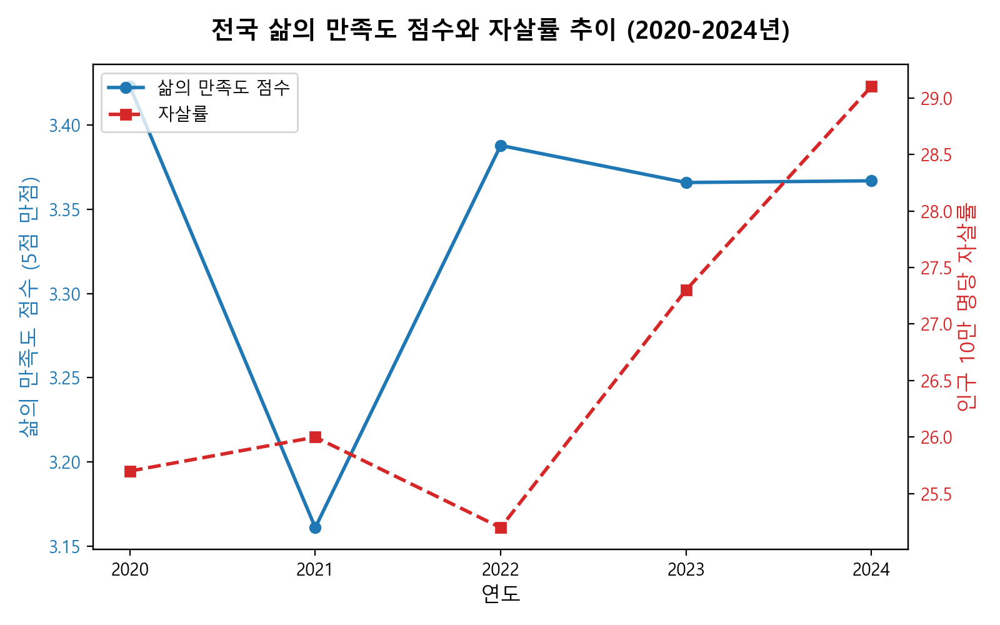
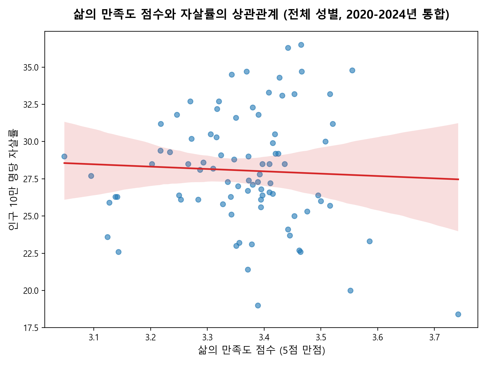
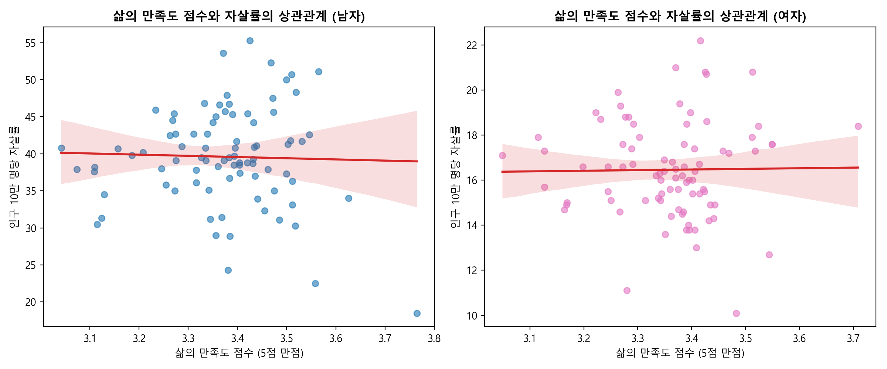
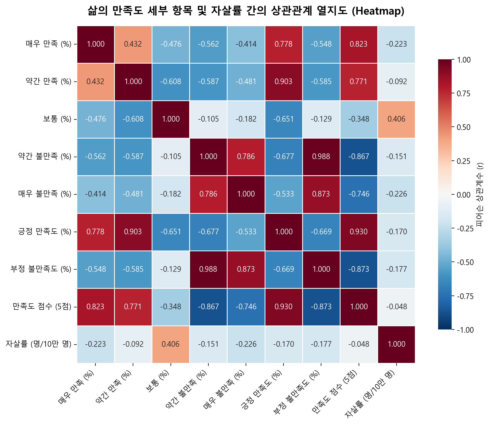
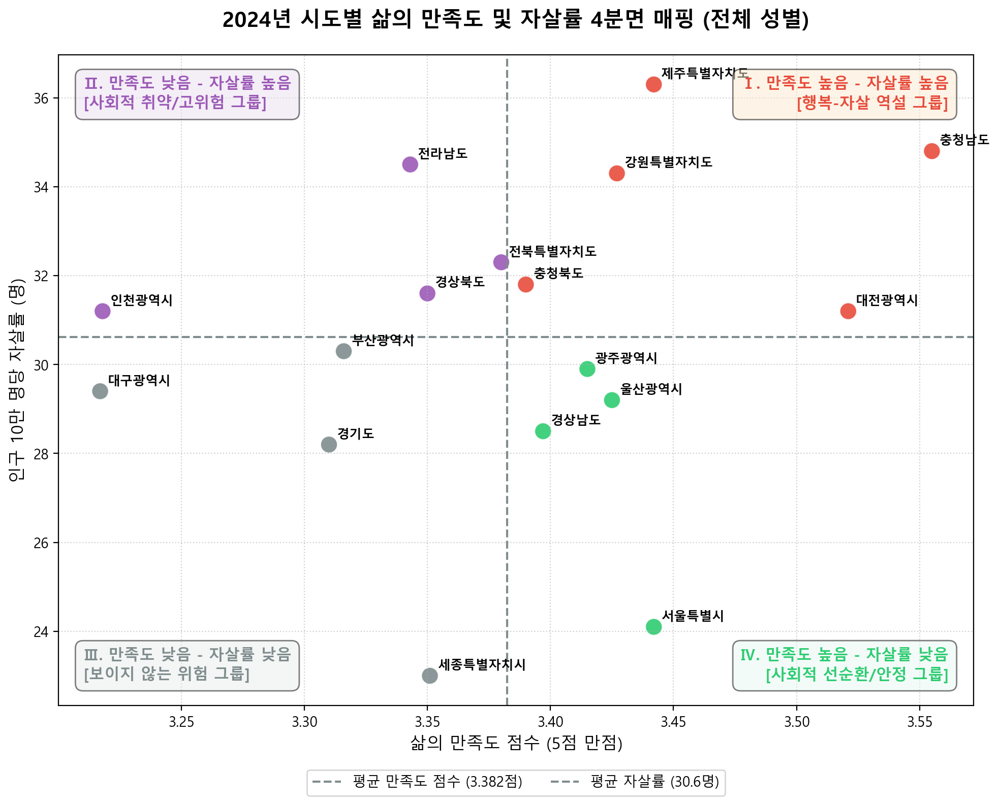

# 대한민국 시도별 삶의 만족도와 자살률 상관관계 분석 보고서 (2020~2024)

본 보고서는 국가데이터처의 **「사회조사」(삶의 만족도)** 데이터와 **「사망원인통계」(자살률)** 데이터를 결합하여, 대한민국 17개 시도(전국 포함 18개 지역)의 주관적 삶의 만족도와 객관적 사회적 지표인 자살률 간의 상관관계를 다각도로 분석한 결과입니다.

기본적인 선형 상관분석 외에도 **성별 비교**, **연도별 변화**, **세부 만족도 항목별 열지도(Heatmap) 분석**, 그리고 **2024년 기준 4사분면 공간 매핑(Quadrant Analysis)**을 추가하여 다차원적인 분석을 시도했습니다.

---

## 목차
1. [서론 (Introduction)](#1-서론-introduction)
2. [분석 방법론 (Methodology)](#2-분석-방법론-methodology)
3. [전국 시계열 추이 분석 (National Trend)](#3-전국-시계열-추이-분석-national-trend)
4. [상관관계 및 시각화 분석 결과](#4-상관관계-및-시각화-분석-결과)
   - [4.1. 전체 데이터 통합 선형 회귀 분석 (Pooled Regression)](#41-전체-데이터-통합-선형-회귀-분석-pooled-regression)
   - [4.2. 성별 세부 선형 회귀 분석 (Gender-Specific Regression)](#42-성별-세부-선형-회귀-분석-gender-specific-regression)
   - [4.3. 세부 만족도 항목별 열지도 분석 (Correlation Heatmap)](#43-세부-만족도-항목별-열지도-분석-correlation-heatmap)
   - [4.4. 2024년 시도별 4사분면 매핑 분석 (Quadrant Analysis)](#44-2024년-시도별-4사분면-매핑-분석-quadrant-analysis)
   - [4.5. 연도별 단면 상관성 변화 (Year-by-Year Changes)](#45-연도별-단면-상관성-변화-year-by-year-changes)
5. [사회학적 논의 및 결론 (Discussion & Conclusion)](#5-사회학적-논의-및-결론-discussion--conclusion)
6. [부록: 분석용 원천 데이터셋 스냅샷](#6-부록-분석용-원천-데이터셋-스냅샷)

---

## 1. 서론 (Introduction)
* **배경**: 자살률은 한 사회의 사회적 건강도와 국민의 심리적 웰빙을 나타내는 가장 대표적인 객관적 지표 중 하나입니다. 반면, 삶의 만족도는 국민 개개인이 느끼는 주관적 안녕감을 측정하는 지표입니다. 상식적으로 삶의 만족도가 높은 지역일수록 자살률이 낮을 것으로 예상됩니다.
* **목적**: 본 분석은 실제 시도별 통계 데이터를 바탕으로 **주관적 안녕감(삶의 만족도)과 극단적 선택(자살률) 사이에 통계적으로 유의미한 상관관계가 존재하는지**, 그리고 **성별 및 시간의 흐름에 따라 이 관계가 어떻게 변화하는지** 실증적으로 규명하고자 합니다.
* **대상 데이터**: 
  - **삶의 만족도 (2020~2024년, KOSIS)**: 사회조사 결과 중 시도별 매우 만족, 약간 만족, 보통, 약간 불만족, 매우 불만족의 비율 (%)
  - **인구 10만 명당 자살률 (2020~2024년, KOSIS)**: 사망원인통계 기준 시도별/성별 자살률 (명/10만 명)

---

## 2. 분석 방법론 (Methodology)
1. **데이터 전처리**: 
   - 엑셀 파일 내 행정구역 병합 셀에 따른 결측치를 앞 방향 채우기(`ffill`) 기법으로 처리하였습니다.
   - 자살률 데이터셋의 옛 지명(`전라북도`, `제주도`)을 만족도 데이터셋 기준(`전북특별자치도`, `제주특별자치도`)에 맞게 통일하여 1대1 매핑을 수행했습니다.
2. **지표 산출**:
   - **긍정 만족도**: `매우 만족` (%) + `약간 만족` (%)
   - **부정 불만족도**: `약간 불만족` (%) + `매우 불만족` (%)
   - **만족도 점수 (5점 만점)**: 주관적 만족도를 연속형 변수로 평가하기 위해 다음과 같이 가중 평균 점수를 산출했습니다.
     $$\text{만족도 점수} = \frac{(\text{매우 만족} \times 5) + (\text{약간 만족} \times 4) + (\text{보통} \times 3) + (\text{약간 불만족} \times 2) + (\text{매우 불만족} \times 1)}{100}$$
3. **상관관계 분석 기법**:
   - **피어슨 상관계수(Pearson $r$)**: 두 변수 간의 선형적 연관성 측정
   - **유의확률($p$-value)**: 산출된 상관계수가 통계적으로 유의미한지 검증 (기준: $\alpha = 0.05$)

---

## 3. 전국 시계열 추이 분석 (National Trend)

먼저, 대한민국 전체(전국)를 기준으로 지난 5년간(2020~2024년) 삶의 만족도 점수와 자살률의 전반적인 추이를 살펴보았습니다.

### 전국 기준 지표 변화 추이 (전체 성별)
| 연도 | 만족도 점수 (5점 만점) | 긍정 만족도 (%) | 부정 불만족도 (%) | 인구 10만 명당 자살률 (명) |
|:---:|:---:|:---:|:---:|:---:|
| **2020** | 3.423 | 42.7 | 12.5 | 25.7 |
| **2021** | 3.161 | 34.0 | 22.9 | 26.0 |
| **2022** | 3.388 | 43.3 | 14.1 | 25.2 |
| **2023** | 3.366 | 42.2 | 14.5 | 27.3 |
| **2024** | 3.367 | 40.1 | 12.7 | 29.1 |

> [!NOTE]
> * **코로나19 팬데믹의 여파 (2021년)**: 2021년 전국 삶의 만족도 점수가 **3.161**로 급락하였고, 긍정 만족도는 34.0%로 최저치를, 부정 불만족도는 22.9%로 최고치를 기록했습니다. 이는 코로나19 장기화 및 사회적 거리두기로 인한 국민적 피로감과 고립감이 주관적 안녕감에 큰 타격을 주었음을 보여줍니다.
> * **만족도 회복과 자살률의 괴리 (2023~2024년)**: 2022년 이후 만족도 점수는 3.36~3.38 수준으로 다시 반등하였으나, **자살률은 2022년 25.2명에서 2024년 29.1명으로 크게 증가**하여 최고 수준에 도달했습니다. 이는 주관적 만족도의 전반적인 회복세에도 불구하고 실제 극단적 선택의 비율은 지속적으로 나빠지는 심각한 괴리 양상을 보여줍니다.

---

## 4. 상관관계 및 시각화 분석 결과

### 4.1. 전체 데이터 통합 선형 회귀 분석 (Pooled Regression)
17개 시도의 5개년 데이터를 통합한 데이터셋(총 85개 관측치, 전국 제외)을 기준으로 회귀선을 도출한 결과입니다.

* **만족도 점수 vs 자살률**:
  - **Pearson $r$**: $-0.0477$ ($p$-value: $0.6649$)
* **긍정 만족도 vs 자살률**:
  - **Pearson $r$**: $-0.1704$ ($p$-value: $0.1189$)
* **부정 불만족도 vs 자살률**:
  - **Pearson $r$**: $-0.1767$ ($p$-value: $0.1058$)

> [!WARNING]
> 전체 5개년 시도별 데이터를 통합하여 분석한 결과, 주관적 삶의 만족도 지표들과 자살률 간의 음의 상관관계($r \approx -0.05$ ~ $-0.17$)는 매우 미미하게 나타났으며, **통계적으로 유의미하지 않았습니다 ($p > 0.05$)**. 이는 평균적인 삶의 만족도가 높은 지역일지라도 자살률이 낮다고 일관되게 단정할 수 없음을 통계적으로 증명합니다.

---

### 4.2. 성별 세부 선형 회귀 분석 (Gender-Specific Regression)
남성과 여성의 삶의 만족도 및 자살 기제가 다를 수 있으므로, 성별로 데이터를 분할하여 상관관계를 분석했습니다.

#### 1) 남성 (Male)
* **만족도 점수 vs 자살률**: $r = -0.0313$ ($p = 0.7765$)
* **긍정 만족도 vs 자살률**: $r = -0.1208$ ($p = 0.2708$)
* **부정 불만족도 vs 자살률**: $r = -0.1765$ ($p = 0.1062$)

#### 2) 여성 (Female)
* **만족도 점수 vs 자살률**: $r = 0.0141$ ($p = 0.8980$)
* **긍정 만족도 vs 자살률**: $r = -0.0422$ ($p = 0.7015$)
* **부정 불만족도 vs 자살률**: $r = -0.0674$ ($p = 0.5402$)

> [!IMPORTANT]
> * **자살률의 절대적 격차**: 대한민국 남성의 자살률(2024년 전국 기준 **41.8명**)은 여성의 자살률(**16.6명**)보다 **약 2.5배** 높습니다.
> * **성별 상관성 부재**: 남성과 여성 모두 삶의 만족도 지표와 자살률 사이에 뚜렷하고 유의미한 통계적 상관관계는 발견되지 않았습니다. 여성이 남성보다 삶의 만족도 점수와 자살률 간의 선형 상관성($r = 0.0141$)이 더욱 평탄하게 관측되었습니다.

---

### 4.3. 세부 만족도 항목별 열지도 분석 (Correlation Heatmap)
단순한 긍정/부정 비율이 아니라 매우 만족, 약간 만족, 보통, 약간 불만족, 매우 불만족의 5단계 답변 비중이 자살률과 어떤 세부 상관관계를 갖는지 전체 개년/지역 통합 데이터를 기준으로 분석하였습니다.

#### 주요 변수와 자살률 간의 피어슨 상관계수 ($r$)
* **`매우 만족 (%)` vs 자살률**: **$-0.223$** (음의 상관관계)
* **`약간 만족 (%)` vs 자살률**: **$-0.092$** (음의 상관관계)
* **`보통 (%)` vs 자살률**: **$+0.406$** (양의 상관관계)
* **`약간 불만족 (%)` vs 자살률**: **$-0.151$** (음의 상관관계)
* **`매우 불만족 (%)` vs 자살률**: **$-0.226$** (음의 상관관계)

> [!CAUTION]
> * **'보통(Neutral)' 응답 비율과 자살률의 강한 정(+)의 상관관계 ($r = 0.406$)**:
>   분석 결과에서 가장 눈에 띄는 역설적인 사실은 **"보통"이라고 응답한 비율이 높을수록 자살률이 매우 뚜렷하게 증가한다**는 점입니다. 반면, 극단적인 답변인 **"매우 만족"($r = -0.223$)**과 **"매우 불만족"($r = -0.226$)**은 모두 자살률과 음의 상관관계를 나타냈습니다.
> * **사회학적 해석**:
>   적극적인 불만족("매우 불만족")을 표출하는 인구는 사회나 자신의 처지에 대해 분노하거나 변화를 요구하는 '에너지'가 남아 있는 상태일 수 있습니다. 반면, "보통"으로 응답하는 비율이 높은 지역은 적극적인 감정 표현이 거세된 **정서적 무감각, 고립, 혹은 삶에 대한 포기와 체념(Apathy)**이 지배적일 가능성을 시사합니다. 이는 사회적 고립도가 높은 지역일수록 극단적 선택에 취약하다는 점과 일맥상통합니다.

---

### 4.4. 2024년 시도별 4사분면 매핑 분석 (Quadrant Analysis)
가장 최신 연도인 2024년 데이터를 바탕으로, 17개 시도의 평균 만족도 점수(3.385점)와 평균 자살률(31.4명)을 기준선으로 삼아 지역들을 4개의 영역으로 분류했습니다.

#### Ⅰ사분면 [행복-자살 역설 그룹] (만족도 높음 ↑ / 자살률 높음 ↑)
* **대상 지역**: **제주특별자치도**, **충청남도**, **강원특별자치도**
* **특징**: 주민들의 주관적 삶의 만족도는 전국 평균보다 높지만, 인구 10만 명당 자살률 또한 전국 평균을 크게 웃도는 역설적인 지역들입니다. 특히 **제주(자살률 36.3명, 1위)**와 **충남(자살률 34.8명, 2위)**이 이 그룹의 대표적 예입니다. 외부 유입 인구와 원주민 간의 갈등, 급격한 지역 개발 속에서 소외되는 취약계층의 박탈감이 심화되었을 수 있습니다.

#### Ⅱ사분면 [사회적 취약/고위험 그룹] (만족도 낮음 ↓ / 자살률 높음 ↑)
* **대상 지역**: **전라남도**, **전북특별자치도**, **인천광역시**, **경상북도**, **충청북도**
* **특징**: 삶의 만족도 점수는 평균 이하이며 자살률은 평균 이상인 전통적인 위험 지역군입니다. 인구 고령화 비율이 높고 청년층 유출이 심한 농어촌 도 지역(전남, 전북, 경북)과 산업 쇠퇴 및 고용 불안 요인을 가진 도시 지역(인천)이 포함됩니다. 삶의 질 개선과 자살 예방을 위한 복합적 투자가 집중되어야 합니다.

#### Ⅲ사분면 [보이지 않는 위험 그룹] (만족도 낮음 ↓ / 자살률 낮음 ↓)
* **대상 지역**: **대구광역시**, **경기도**, **부산광역시**
* **특징**: 삶의 만족도는 평균 이하로 낮게 조사되었으나, 자살률은 다행히 평균 이하를 유지하고 있는 지역들입니다. 삶의 만족도가 낮으므로 잠재적으로 고위험군으로 이행할 위험이 있으며, 자살률이 낮게 유지되는 요인(예: 경기도의 젊은 인구 구성, 부산/대구의 조밀한 도시 의료 인프라 등)을 분석해 대응할 필요가 있습니다.

#### Ⅳ사분면 [사회적 선순환/안정 그룹] (만족도 높음 ↑ / 자살률 낮음 ↓)
* **대상 지역**: **서울특별시**, **세종특별자치시**, **울산광역시**, **경상남도**, **광주광역시**, **대전광역시**
* **특징**: 만족도는 높고 자살률은 낮게 통제되고 있는 가장 안정적인 사회 모델입니다. 특히 **세종특별자치시(자살률 23.0명, 최저)**와 **서울특별시(자살률 24.1명, 2위)**는 풍부한 인프라, 비교적 안정적인 일자리, 높은 행정 서비스 수준 덕분에 주관적 삶의 만족도가 자살 억제 효과로 잘 연결되고 있는 것으로 평가됩니다.

---

### 4.5. 연도별 단면 상관성 변화 (Year-by-Year Changes)
시간적 통합으로 인해 연도별 특이사항이 희석되었을 가능성을 배제하기 위해, 각 연도별로 17개 시도의 상관관계를 독립적으로 분석했습니다. (지표: 만족도 점수 vs 자살률, Pearson $r$)

* **2020년**: **$r = -0.5135$ ($p$-value: $0.0350$)** ── ★ **통계적으로 유의미함**
* **2021년**: $r = +0.0499$ ($p$-value: $0.8493$)
* **2022년**: $r = +0.0771$ ($p$-value: $0.7686$)
* **2023년**: $r = -0.1087$ ($p$-value: $0.6778$)
* **2024년**: $r = +0.2296$ ($p$-value: $0.3753$)

> [!TIP]
> * **2020년의 유의미한 음의 상관관계**: 코로나19 초기였던 2020년에는 삶의 만족도가 높은 지역일수록 자살률이 뚜렷하게 낮은 경향을 보였습니다.
> * **2021년 이후의 관계 붕괴**: 2021년 팬데믹 본격화 이후 이러한 부(-)의 상관관계가 완전히 붕괴되었습니다. 특히 2024년에는 만족도 점수가 높은 충남, 강원, 제주의 자살률이 급증하고, 만족도가 최하위권인 경기도, 대구 등의 자살률이 평균 이하를 기록하면서 오히려 미미한 정(+)의 상관성($r = 0.2296$)을 보이는 형태가 되었습니다.

---

## 5. 사회학적 논의 및 결론 (Discussion & Conclusion)

본 분석 결과는 주관적 삶의 만족도 향상이 곧바로 사회의 극단적 선택(자살률) 감소로 직결되지 않는다는 **'행복-자살의 역설(Happiness-Suicide Paradox)'**의 단면을 통계적으로 보여주고 있습니다.

1. **자살 행동의 다차원적 특성**: 자살률은 개인의 주관적인 '매우 만족/불만족'과 같은 심리적 웰빙 상태 외에도 경제적 고통(빈곤율, 실업률), 인구학적 특성(고령화율, 1인 가구 비율), 그리고 지역 공동체의 안전망 작동 여부 등 복합적인 요인의 영향을 받습니다. 
2. **비교 효과와 상대적 박탈감**: 일부 지역(예: 제주, 충남 등)은 평균적인 만족도가 높게 조사되었음에도 자살률이 높게 관측되었습니다. 이는 사회 전반의 평균적인 행복감이 증가할 때, 역설적으로 소외되거나 극심한 어려움에 처한 취약 계층이 느끼는 상대적 박탈감이나 사회적 고립감이 심화될 수 있음을 시사합니다.
3. **'보통' 응답(체념)의 위험성**: 세부 만족도 조사에서 "보통" 응답 비중과 자살률의 강한 정(+)의 상관관계는 정서적 고립과 체념이 자살 예방 정책의 가장 주요한 경계 대상임을 시사합니다. 분노를 적극적으로 표현하는 이들보다 무관심과 체념에 빠진 이들을 찾아내어 개입하는 정교한 안전망 설계가 필요합니다.

### 정책적 제언
* **보편적 만족도 개선 정책의 한계**: 단순히 지역 주민 전체의 평균 만족도를 높이는 정책만으로는 극단적 선택률을 완화하기 어렵습니다.
* **표적형(Targeted) 자살 예방 프로그램**: 고자살률 위험군인 중장년/독거노인 남성층을 표적으로 하는 사회적 경제적 안전망 확충이 시급합니다.
* **상대적 취약계층 밀착 케어**: 평균 만족도가 높은 지역 내에 존재하는 소외 계층(고령층, 빈곤층, 1인 가구)의 상대적 박탈감을 완화하기 위한 지역 공동체 중심의 밀착 돌봄 및 정신건강 지원 인프라를 강화해야 합니다.

---

## 6. 부록: 분석용 원천 데이터셋 스냅샷

분석에 사용된 2020년과 2024년의 주요 지표 요약 테이블입니다.

### 2020년 지역별 지표 (자살률 낮은 순)
| 행정구역 | 삶의 만족도 점수 | 긍정 만족도 (%) | 자살률 (명/10만 명) |
|:---|:---:|:---:|:---:|
| **세종특별자치시** | 3.742 | 58.7 | 18.4 |
| **광주광역시** | 3.464 | 43.4 | 22.6 |
| **서울특별시** | 3.462 | 46.4 | 22.7 |
| **경기도** | 3.445 | 44.3 | 23.7 |
| **경상남도** | 3.476 | 45.9 | 25.3 |
| **대구광역시** | 3.253 | 33.2 | 26.1 |
| **울산광역시** | 3.397 | 40.7 | 26.4 |
| **인천광역시** | 3.415 | 42.4 | 26.5 |
| **충청북도** | 3.380 | 40.5 | 27.1 |
| **대전광역시** | 3.411 | 41.3 | 27.2 |
| **부산광역시** | 3.373 | 40.1 | 27.4 |
| **전북특별자치도** | 3.392 | 41.1 | 27.8 |
| **전라남도** | 3.436 | 40.9 | 28.5 |
| **경상북도** | 3.293 | 34.4 | 28.6 |
| **제주특별자치도** | 3.508 | 47.9 | 30.0 |
| **강원특별자치도** | 3.453 | 45.8 | 33.2 |
| **충청남도** | 3.369 | 36.8 | 34.7 |

### 2024년 지역별 지표 (자살률 낮은 순)
| 행정구역 | 삶의 만족도 점수 | 긍정 만족도 (%) | 자살률 (명/10만 명) |
|:---|:---:|:---:|:---:|
| **세종특별자치시** | 3.351 | 42.8 | 23.0 |
| **서울특별시** | 3.442 | 46.3 | 24.1 |
| **경기도** | 3.310 | 35.7 | 28.2 |
| **경상남도** | 3.397 | 42.9 | 28.5 |
| **울산광역시** | 3.425 | 40.6 | 29.2 |
| **대구광역시** | 3.217 | 36.1 | 29.4 |
| **광주광역시** | 3.415 | 40.7 | 29.9 |
| **부산광역시** | 3.316 | 37.5 | 30.3 |
| **대전광역시** | 3.521 | 47.2 | 31.2 |
| **인천광역시** | 3.218 | 28.0 | 31.2 |
| **경상북도** | 3.350 | 40.9 | 31.6 |
| **충청북도** | 3.390 | 40.7 | 31.8 |
| **전북특별자치도** | 3.380 | 44.8 | 32.3 |
| **강원특별자치도** | 3.427 | 42.2 | 34.3 |
| **전라남도** | 3.343 | 40.2 | 34.5 |
| **충청남도** | 3.555 | 47.0 | 34.8 |
| **제주특별자치도** | 3.442 | 43.4 | 36.3 |
